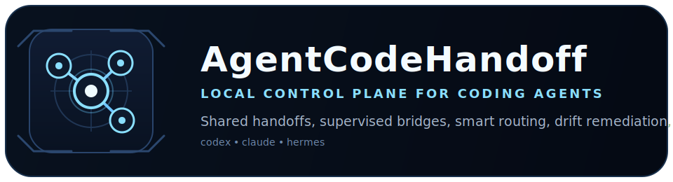

<p align="center">
  
</p>

<p align="center"><strong>Local control plane for bring-your-own coding agents.</strong></p>

<p align="center">
  <em>A local-first shared handoff, supervision, and ops layer for Codex, Claude Code, Hermes, and other terminal agents.</em>
</p>

`agentcodehandoff` gives multiple coding agents one coordination layer inside a shared repo: clear handoffs, explicit ownership, supervised bridge processes, workflow-state updates, and a durable local record of who is doing what.

It is intentionally a coordination layer, not a hosted model provider. You bring your own local agent CLIs and auth state. AgentCodeHandoff handles the collaboration.

It is built for teams running:

- Codex + Claude + Hermes
- two or more agent terminals on one machine
- one shared codebase
- a zero-infrastructure workflow

It now supports:

- 3-agent supervised team startup with `local-trio`
- availability-aware routing and graceful fallback when one agent is rate-limited or offline
- interactive terminal ops for recovery, sweeping, and request resolution
- live-verified Claude bridge replies via structured JSON output

## Why Teams Need It

Most multi-agent coding workflows break on coordination, not model quality:

- no durable handoff stream
- no clear ownership of files or scopes
- no quick way to see who is doing what
- no shared notion of blocked, done, or review-ready work
- too much manual relaying between terminals

`agentcodehandoff` fixes that with a small, explicit local state model:

- `~/.agentcodehandoff/inbox.jsonl`
- `~/.agentcodehandoff/claims.json`

## What This Is

- A local-first coordination layer for Codex, Claude Code, Hermes, and similar terminal agents
- A shared handoff, routing, supervision, and recovery system that runs on your machine
- A way to make already-installed agents collaborate inside one repo without constant human relaying

## What This Is Not

- Not a hosted agent platform
- Not a model provider
- Not a third-party Claude subscription harness
- Not a resale layer for API or subscription access

## Authentication Model

AgentCodeHandoff follows a bring-your-own-agent model:

- you install and authenticate Codex, Claude Code, Hermes, or other local agent CLIs yourself
- AgentCodeHandoff launches those local CLIs as workers
- credentials stay with the local runtime of those tools

This repo is designed for local orchestration of user-controlled agent runtimes. It is not designed to proxy or resell third-party subscription access through a hosted service.

## What It Includes

- Shared inbox for agent-to-agent handoffs
- Lightweight claim board for file and scope ownership
- Availability-aware routing across Codex, Hermes, and Claude
- Workflow updates for `request`, `done`, `blocked`, and `review`
- Request lifecycle tracking with `acknowledged`, `done`, `blocked`, `review`, `closed`, `approved`, and `escalated`
- Claim resolution with final states like `completed`, `blocked`, and `abandoned`
- Git worktree-backed agent sessions for isolated edit space
- File-awareness checks that compare live session edits to claimed files
- Drift suggestions and safe remediation for expand, handoff, and split-work flows
- Supervised bridge lifecycle commands with pid, heartbeat, and pending request visibility
- Saved bridge profiles, reusable presets, and one-command team lifecycle controls
- Automatic timeout recovery with reminders, reroutes, and escalation when safe recovery is exhausted
- Terminal-first workflow for two or more agents in one repo
- Paneled terminal dashboard for bridge health, workflow, requests, claims, conflicts, and recent messages
- Interactive ops dashboard with direct recovery and request-resolution shortcuts
- Local-first state with no daemon required
- Agent-specific wrapper commands for faster day-to-day use

## Current State

This repo is no longer just a shared inbox prototype. The current build supports:

- local pair and local trio presets
- supervised `up` / `down` / `restart-team` lifecycle commands
- persistent bridge recovery profiles
- interactive operator controls from the terminal dashboard
- explicit availability overrides for rate-limited or offline agents
- live trio verification with Codex, Hermes, and Claude

## Public Alpha Verification

The current build has been verified against the real local toolchain, not just isolated tests.

Live verification completed with:

- `agentcodehandoff up --template local-trio`
- real supervised bridges for Codex, Hermes, and Claude
- real requests sent through AgentCodeHandoff into the shared inbox
- real automatic replies written back by Hermes and Claude

Observed live replies:

- `hermes -> codex`
  - `Acknowledged public release verification`
- `claude -> codex`
  - `ACK: Public release live verification task received`

That confirms the public-alpha story is accurate: this tool can bring up a real local trio, coordinate requests, and receive actual bridge-written replies through the shared collaboration layer.

## Positioning

The product story is intentionally simple:

- you already have agent tools
- you already pay for them however you choose
- AgentCodeHandoff makes them coordinate

That keeps the tool lightweight, local, and practical for real engineering workflows.

## Quick Start

```bash
cd agent-inbox
./install.sh
```

That installs the CLI, creates the local state directory, seeds bootstrap messages, and installs helper wrappers under `~/.local/bin`.

Try a disposable end-to-end demo:

```bash
./examples/demo-session.sh
```

For the full supervised collaboration path, start with:

1. `agentcodehandoff doctor`
2. `agentcodehandoff up --template local-trio --repo /path/to/repo`
3. `agentcodehandoff dashboard --view ops --interactive`
4. `agentcodehandoff bridge-status`
5. `agentcodehandoff requests`
6. `agentcodehandoff availability`

If you are the second collaborator terminal, keep this shorter loop:

1. `agentcodehandoff-hermes-watch`
2. `agentcodehandoff dashboard --view ops`
3. `agentcodehandoff bridge-status`
4. `agentcodehandoff bridge-profile-show --agent hermes`

## First Run

```bash
agentcodehandoff doctor
agentcodehandoff status
```

For a read-only observer setup, start two terminals:

```bash
agentcodehandoff-codex-watch
agentcodehandoff-hermes-watch
agentcodehandoff-claude-watch
```

For manually managed auto-reply bridges, start them in real terminals:

```bash
agentcodehandoff-codex-auto --repo /Users/iris/Projects/agent-inbox
agentcodehandoff-hermes-auto --repo /Users/iris/Projects/agent-inbox
agentcodehandoff-claude-auto --repo /Users/iris/Projects/agent-inbox
```

Enable automatic file claims from bridge replies:

```bash
agentcodehandoff-hermes-auto --repo /Users/iris/Projects/agent-inbox --claim-on-files
```

Check whether the bridges appear alive:

```bash
agentcodehandoff auto-status
```

Override an agent's availability when you already know it is offline or rate-limited:

```bash
agentcodehandoff availability-set --agent claude --state rate-limited --note "subscription window exhausted"
agentcodehandoff availability
```

For day-to-day supervised operation, prefer managed background bridges instead of keeping separate reply terminals open:

```bash
agentcodehandoff bridge-start --agent codex --repo /path/to/repo --auto-sweep
agentcodehandoff bridge-start --agent hermes --repo /path/to/repo --auto-sweep
agentcodehandoff bridge-start --agent claude --repo /path/to/repo --auto-sweep
```

Or apply the built-in trio preset in one step:

```bash
agentcodehandoff bridge-preset-apply --name local-trio --repo /path/to/repo --start
```

Or use the higher-level team lifecycle commands:

```bash
agentcodehandoff up --template local-trio --repo /path/to/repo
agentcodehandoff down --template local-trio --repo /path/to/repo
agentcodehandoff restart-team --template local-trio --repo /path/to/repo
```

The `local-trio` flow has been live-verified with Codex, Hermes, and Claude replying through supervised bridges.

## Visuals

Primary assets in this repo:

- brand mark: `assets/agentcodehandoff-mark.svg`
- README lockup: `assets/agentcodehandoff-lockup.svg`
- social preview: `assets/agentcodehandoff-social-preview.svg`

For GitHub repo presentation, use `assets/agentcodehandoff-social-preview.svg` as the social preview image.

For live terminal operations, enable dashboard actions:

```bash
agentcodehandoff dashboard --view ops --interactive
```

Keys:
- `a` apply the top safe ops action
- `r` recover bridges
- `s` sweep stale requests
- `p` approve the top actionable request resolution
- `c` close the top actionable request resolution
- `e` escalate the top actionable request resolution
- `q` quit

Inspect supervised bridge health:

```bash
agentcodehandoff ps
agentcodehandoff bridge-status
agentcodehandoff logs --agents claude --lines 40
agentcodehandoff bridge-profiles
agentcodehandoff bridge-presets
```

Open the live terminal dashboard. Use the default view for coordination and the ops view for bridge supervision, stale requests, and recovery visibility:

```bash
agentcodehandoff-dashboard
agentcodehandoff dashboard --view ops
agentcodehandoff ops-next
```

Send a handoff:

```bash
agentcodehandoff-codex-send \
  --summary "Need a realism pass" \
  --details "Own MeshGraph.tsx only" \
  --files "frontend/src/components/MeshGraph.tsx"
```

Send an auto-reply request:

```bash
agentcodehandoff-codex-request \
  --summary "Need a quick review" \
  --details "Reply automatically with short feedback." \
  --files "README.md"
```

Route a request automatically:

```bash
agentcodehandoff dispatch \
  --from-agent codex \
  --summary "Fix failing CLI test" \
  --details "Investigate the parser behavior and send it to the best agent automatically." \
  --files "src/agentcodehandoff/cli.py,README.md"
```

Claim a scope:

```bash
agentcodehandoff-hermes-claim \
  --scope meshgraph-pass \
  --summary "Owning cinematic sphere polish" \
  --files "frontend/src/components/MeshGraph.tsx"
```

Send a completion update:

```bash
agentcodehandoff-codex-done \
  --summary "CLI workflow states shipped" \
  --details "done, blocked, review, and claim resolution are live." \
  --files "src/agentcodehandoff/cli.py,README.md"
```

Signal a blocker:

```bash
agentcodehandoff-hermes-blocked \
  --summary "Need routing policy input" \
  --details "Current heuristics are too generic for design-vs-code review tasks." \
  --files "src/agentcodehandoff/cli.py"
```

Request review:

```bash
agentcodehandoff-codex-review \
  --summary "Review the dispatch heuristics" \
  --details "Check whether docs-heavy mixed tasks should route to Hermes." \
  --files "src/agentcodehandoff/cli.py,README.md"
```

Resolve a claim:

```bash
agentcodehandoff resolve \
  --agent codex \
  --scope cli-workflow-pass \
  --status completed \
  --note "Merged and verified locally."
```

Start an isolated worktree session:

```bash
agentcodehandoff session-start \
  --agent codex \
  --scope parser-pass \
  --repo /path/to/repo \
  --note "Isolated parser refactor worktree"
```

List sessions:

```bash
agentcodehandoff sessions
```

Close a session and remove its worktree:

```bash
agentcodehandoff session-end \
  --agent codex \
  --scope parser-pass \
  --note "Merged and cleaned up"
```

Inspect live drift against claimed files:

```bash
agentcodehandoff drift
```

Get actionable scope suggestions:

```bash
agentcodehandoff suggest
```

Inspect request lifecycle state:

```bash
agentcodehandoff requests
```

Resolve a tracked request explicitly:

```bash
agentcodehandoff request-resolve --request-id msg-123 --action approve
agentcodehandoff request-resolve --request-id msg-123 --action close
```

Sweep stale requests and apply timeout actions:

```bash
agentcodehandoff request-sweep
```

Let supervised bridges recover their own stale requests automatically:

```bash
agentcodehandoff bridge-start --agent codex --repo /path/to/repo --auto-sweep --sweep-interval 30 --max-restarts 5
```

Recover paused or down bridges with one command:

```bash
agentcodehandoff bridge-recover
```

Bridge recovery uses the last saved per-agent profile even after a full stop removes the live lock.

## Recommended Onboarding For Codex + Claude/Hermes

This is the clearest path for two-agent collaboration in one shared repo.

1. Install and verify local state.

```bash
./install.sh
agentcodehandoff doctor
```

2. Start supervised bridges for each agent that should auto-reply.

```bash
agentcodehandoff bridge-start --agent codex --repo /path/to/repo --auto-sweep
agentcodehandoff bridge-start --agent hermes --repo /path/to/repo --auto-sweep
```

3. Keep one terminal on the ops dashboard.

```bash
agentcodehandoff dashboard --view ops
```

4. In active agent terminals, use claims plus `request`, `done`, `blocked`, and `review` updates.

5. If a bridge stops responding, inspect it first:

```bash
agentcodehandoff bridge-status
agentcodehandoff requests
agentcodehandoff request-sweep
```

6. If the bridge is down or paused, recover it using the saved profile:

```bash
agentcodehandoff bridge-recover
```

7. If recovery is exhausted, fall back to manual auto terminals:

```bash
agentcodehandoff-codex-auto --repo /path/to/repo
agentcodehandoff-hermes-auto --repo /path/to/repo
```

This gives a clean split:

- supervised bridges for normal unattended routing
- ops dashboard for health and stale-request visibility
- manual auto terminals as a safe fallback during bring-up or debugging

## Supervised Bridge Workflow

Use this when you want the tool to keep automation alive without manual babysitting.

Start bridges:

```bash
agentcodehandoff bridge-start --agent codex --repo /path/to/repo --auto-sweep
agentcodehandoff bridge-start --agent hermes --repo /path/to/repo --auto-sweep
```

Inspect health:

```bash
agentcodehandoff bridge-status
agentcodehandoff dashboard --view ops
```

Common checks:

- `bridge-status` for pid, heartbeat, pending requests, restart counts, and saved profile timestamps
- `dashboard --view ops` for at-a-glance bridge state, stale requests, and remediation context
- `requests` and `request-sweep` when work is stuck but the bridge still appears alive

Stop or restart a specific bridge:

```bash
agentcodehandoff bridge-stop --agent codex
agentcodehandoff bridge-restart --agent codex --repo /path/to/repo
```

## Profile Recovery Workflow

Supervised bridges persist a per-agent profile so recovery does not depend on a live lock file surviving.

Typical recovery loop:

1. A bridge is down, paused, or missing after a shell restart.
2. `agentcodehandoff bridge-status` shows no healthy live process, but still shows the saved repo profile.
3. `agentcodehandoff bridge-recover` restarts the bridge using the last saved settings.
4. `agentcodehandoff dashboard --view ops` confirms heartbeat and pending request state.

Example:

```bash
agentcodehandoff bridge-status
agentcodehandoff bridge-recover
agentcodehandoff bridge-status
```

Use `bridge-recover --fail-if-idle` in scripts when you want a non-zero exit if nothing actually needed recovery.

Inspect or delete a saved bridge profile:

```bash
agentcodehandoff bridge-profile-show --agent codex
agentcodehandoff bridge-profile-delete --agent hermes
```

Save reusable bridge presets and apply them later:

```bash
agentcodehandoff bridge-preset-save --name local-pair --agents codex hermes
agentcodehandoff bridge-preset-apply --name local-pair --start
```

Ask the tool for the single most important next ops action:

```bash
agentcodehandoff ops-next
agentcodehandoff ops-next --apply
agentcodehandoff ops-next --apply --create-session
```

Apply a safe remediation automatically:

```bash
agentcodehandoff remediate --agent codex --scope parser-pass
```

Create a new split scope and session when drift becomes separate work:

```bash
agentcodehandoff remediate --agent codex --scope parser-pass --create-session
```

## Core Commands

```bash
agentcodehandoff init --install-wrappers --seed
agentcodehandoff doctor
agentcodehandoff read --agent codex
agentcodehandoff watch --agent hermes
agentcodehandoff latest --agent hermes
agentcodehandoff status
agentcodehandoff auto-status
agentcodehandoff dashboard
agentcodehandoff-dashboard
agentcodehandoff-status
agentcodehandoff claims
agentcodehandoff sessions
agentcodehandoff drift
agentcodehandoff suggest
agentcodehandoff requests
agentcodehandoff request-sweep
agentcodehandoff remediate --agent codex --scope parser-pass
agentcodehandoff bridge-status
agentcodehandoff resolve --agent codex --scope cli-pass --status completed
```

## Demo

`examples/demo-session.sh` runs a safe local session in `/tmp`:

- initializes state
- creates wrappers
- records a claim
- sends a request-style handoff
- prints status
- prints the next supervised bridge and ops commands to try in a real repo

## Testing

Run the current critical-path test suite with:

```bash
python3 -m unittest discover -s tests -v
```

The current suite covers:

- `init` and `doctor` against isolated fake Codex, Hermes, and Claude CLIs
- availability overrides and routing fallback
- bridge preset persistence for `local-trio`
- bridge startup validation for missing agent CLIs and non-git repos
- stale lock cleanup and paused-bridge recovery from saved profiles
- restart-cap pause behavior for supervised bridges
- per-agent bridge log access
- compact per-agent team summaries with `ps`
- supervised `local-trio` startup plus an actual Claude bridge reply in an isolated temp repo
- tracked request resolution

This is the current release-hardening baseline. Before a broad public release, the suite should continue to grow around deeper drift/remediation flows and additional long-running provider/runtime behaviors.

## Known Limitations

- Agent bridge behavior still depends on the local Codex, Claude, and Hermes CLIs being installed and authenticated in the environment that launches the bridge.
- Public users should still expect local runtime/environment differences across agent CLIs, but `bridge-start` now fails early for invalid repos and missing agent CLIs instead of deferring that failure to a background process.
- Real provider/runtime differences can still surface outside the isolated fake-agent test suite.
- The dashboard is terminal-first and intentionally lightweight; it is not a full graphical control plane.
- The current test suite is strong on critical paths, but not yet exhaustive across every command combination.
- Claude Code behavior depends on the local `claude` CLI being installed and authenticated in the same runtime environment where the bridge process is launched.

## Wrapper Commands

Installed by `agentcodehandoff init --install-wrappers`:

- `agentcodehandoff-dashboard`
- `agentcodehandoff-auto-status`
- `agentcodehandoff-status`
- `agentcodehandoff-sessions`
- `agentcodehandoff-drift`
- `agentcodehandoff-suggest`
- `agentcodehandoff-requests`
- `agentcodehandoff-request-sweep`
- `agentcodehandoff-remediate`
- `agentcodehandoff-availability`
- `agentcodehandoff-availability-set`
- `agentcodehandoff-up`
- `agentcodehandoff-down`
- `agentcodehandoff-restart-team`
- `agentcodehandoff-bridge-status`
- `agentcodehandoff-codex-watch`
- `agentcodehandoff-hermes-watch`
- `agentcodehandoff-claude-watch`
- `agentcodehandoff-codex-read`
- `agentcodehandoff-hermes-read`
- `agentcodehandoff-claude-read`
- `agentcodehandoff-codex-auto`
- `agentcodehandoff-hermes-auto`
- `agentcodehandoff-claude-auto`
- `agentcodehandoff-codex-send`
- `agentcodehandoff-hermes-send`
- `agentcodehandoff-claude-send`
- `agentcodehandoff-codex-request`
- `agentcodehandoff-hermes-request`
- `agentcodehandoff-claude-request`
- `agentcodehandoff-codex-claim`
- `agentcodehandoff-hermes-claim`
- `agentcodehandoff-claude-claim`
- `agentcodehandoff-codex-done`
- `agentcodehandoff-hermes-done`
- `agentcodehandoff-claude-done`
- `agentcodehandoff-codex-blocked`
- `agentcodehandoff-hermes-blocked`
- `agentcodehandoff-claude-blocked`
- `agentcodehandoff-codex-review`
- `agentcodehandoff-hermes-review`
- `agentcodehandoff-claude-review`
- `agentcodehandoff-codex-release`
- `agentcodehandoff-hermes-release`
- `agentcodehandoff-claude-release`

## Typical Workflow

1. Agent A claims a bounded scope.
2. Agent B claims a non-overlapping scope.
3. Both agents keep `watch` or `dashboard` running.
4. Use `request` for work that expects a response.
5. Use `done`, `blocked`, or `review` so progress reads like a workflow, not raw chat.
6. Resolve claims with `completed`, `blocked`, or `abandoned` when work closes out.
7. Use `agentcodehandoff status` to inspect latest handoffs, workflow events, open claims, and recently resolved claims.

## Terminal Dashboard

`agentcodehandoff-dashboard` is the fastest way to understand live system state in one terminal.

It shows:

- bridge health for Codex, Hermes, and Claude
- latest handoffs
- workflow events like `request`, `blocked`, `review`, and `done`
- open claims
- claim conflicts
- recently resolved claims
- recent message traffic
- active worktree sessions
- file-awareness drift summaries
- actionable suggestions for expand, split, or handoff decisions
- safe remediation helpers for claim expansion and handoff generation
- split-work remediation that can create a new claim and optional session
- request lifecycle tracking with pending, acknowledged, stale, and outcome states
- stale-request sweep for reminders and reroutes

## Worktree Sessions

`agentcodehandoff` can manage isolated git worktrees per agent and scope.

Use this when you want:

- one agent per branch/worktree
- clean physical separation of edits
- session state that matches claim state
- dashboard visibility into who owns which workspace

By default, sessions create worktrees under:

- `<repo>/.worktrees/<agent>-<scope-slug>`

Default branch naming:

- `ach/<agent>/<scope-slug>`

Core commands:

```bash
agentcodehandoff session-start --agent codex --scope parser-pass --repo /path/to/repo
agentcodehandoff sessions
agentcodehandoff drift
agentcodehandoff suggest
agentcodehandoff session-end --agent codex --scope parser-pass
```

## Auto Reply

`agentcodehandoff auto --agent <name>` watches the inbox and uses a local agent CLI to generate a JSON reply automatically.

- `hermes` uses `hermes chat -Q -q`
- `codex` uses `codex --sandbox read-only exec`
- `claude` uses `claude -p`

Example:

```bash
agentcodehandoff-hermes-auto --repo /Users/iris/Projects/agent-inbox
agentcodehandoff-codex-auto --repo /Users/iris/Projects/agent-inbox
agentcodehandoff-claude-auto --repo /Users/iris/Projects/agent-inbox
agentcodehandoff auto-status
```

Auto-claim example:

```bash
agentcodehandoff-hermes-auto \
  --repo /Users/iris/Projects/agent-inbox \
  --claim-on-files
```

Notes:

- `claude` requires a valid Claude Code CLI login in the shell environment where the bridge runs.
- smart routing automatically deprioritizes agents with auth, rate-limit, or paused bridge failures when supervision state is available.

- this works only in a real terminal environment where Hermes and Codex can reach their providers
- it is not expected to work inside a restricted offline sandbox
- the auto bridge only replies to messages addressed to that agent
- auto bridges only respond to `request`, `task`, and `auto-request` roles
- plain `handoff` messages are informational and do not auto-trigger replies

## Bridge Supervision

Supervised bridges let the tool keep automation running without constant manual babysitting.

What supervision adds:

- one managed background bridge per agent
- pid and heartbeat tracking
- pending request visibility
- log file paths for bridge output
- restart counts and failure classification
- paused state on hard failures like bad repo/auth/config problems
- lifecycle commands to start, stop, restart, and inspect bridges

Core commands:

```bash
agentcodehandoff bridge-start --agent codex --repo /path/to/repo
agentcodehandoff bridge-stop --agent codex
agentcodehandoff bridge-restart --agent codex --repo /path/to/repo
agentcodehandoff bridge-status
```

## Smart Routing

`agentcodehandoff route` scores a request for Codex vs Hermes:

- Hermes is preferred for docs, copy, README, install, review, and UX-oriented work
- Codex is preferred for bugs, tests, refactors, CLI/code changes, and build/debug work

Examples:

```bash
agentcodehandoff route \
  --summary "Improve README onboarding" \
  --details "Tighten install wording and first-run instructions." \
  --files "README.md,install.sh"
```

```bash
agentcodehandoff dispatch \
  --from-agent codex \
  --summary "Fix parser bug" \
  --details "Investigate failing CLI state handling and route to the best agent." \
  --files "src/agentcodehandoff/cli.py"
```

## Configuration

- Default state directory: `~/.agentcodehandoff`
- Override with `AGENTCODEHANDOFF_HOME`
- Default wrapper directory: `~/.local/bin`
- Default session state file: `~/.agentcodehandoff/sessions.json`

## Support Matrix

- Python: `3.10+`
- Operating model: local-first, terminal-first
- Repo type: local git repositories
- Agent CLIs: Codex, Claude, and Hermes are the primary supported agents today
- Platform expectation: Unix-like environments with `git`, `python3`, and standard process semantics

### Runtime model

- Local machine: supported
- Shared repo on local filesystem: supported
- User-managed local agent CLIs: supported
- Hosted relay of third-party subscription credentials: not supported

Current support is strongest for:

- local development on macOS and Linux-style shells
- one machine coordinating two or three terminal agents
- repos where the local agent CLIs are already installed and authenticated

Current non-goals:

- hosted/cloud orchestration
- remote multi-machine coordination
- GUI-first workflows

## Positioning

`agentcodehandoff` is intentionally narrow:

- not a cloud orchestration platform
- not a task router with hidden state
- not a heavyweight agent framework
- not a hosted relay for third-party subscription credentials

It is the coordination layer you add when multiple coding agents already exist and need to collaborate reliably in one repo.

## Roadmap

- interactive TUI
- file change awareness
- repo-aware claim suggestions
- notifications
- optional HTTP/WebSocket relay

## Release Checklist

Before a broad public release, make sure all of these are true:

- `python3 -m unittest discover -s tests -v` passes
- `python3 -m py_compile src/agentcodehandoff/cli.py tests/test_cli.py` passes
- GitHub Actions CI is green
- `install.sh` works on a fresh machine/user profile
- `doctor` gives actionable output for missing CLIs and invalid repos
- `up --template local-trio` and `down --template local-trio --force` are verified in a disposable repo
- `bridge-status`, `logs`, `ps`, and `dashboard --view ops` all reflect the same bridge reality
- README examples still match the actual CLI flags and command names
- known limitations are still accurate
- screenshots or terminal captures are current

## Contributing

See [CONTRIBUTING.md](CONTRIBUTING.md).

## Support

- bug reports: use the GitHub bug template and include `ps`, `bridge-status`, and `logs` output
- feature requests: use the GitHub feature template
- security issues: see [SECURITY.md](SECURITY.md) and report privately first

## Changelog

See [CHANGELOG.md](CHANGELOG.md).

## License

See [LICENSE](LICENSE).
